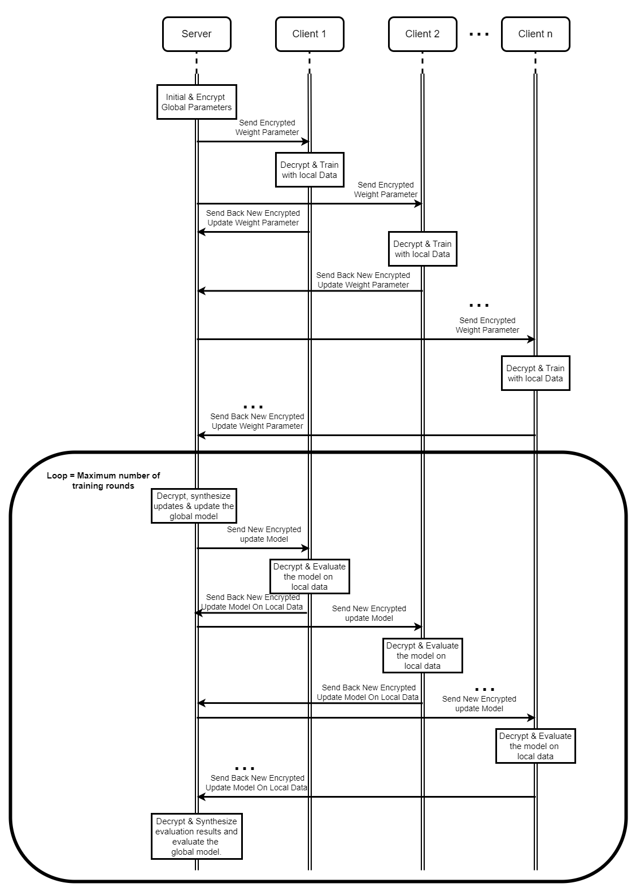

# Enhancing Security for Smart Ehealthcare System based on Federated Learning and Homomorphic Encryption

## Abstract 
Medical records are one of the most sensitive types
of data, so when applying machine learning models, it is necessary
to ensure data privacy. In recent years, machine learning and
pre-trained models have been developing rapidly, and medical
data security when using those models is gaining strong appeal
with researchers. This study proposes a federated learning model
integrated with homomorphic encryption to enhance security
and privacy while training machine learning models on medical
datasets. Additionally, we conducted experiments with federated
learning models using different data distribution ratios to evaluate the robustness of this approach. The results show that the
CNN, ResNet50, ResNet152, and DenseNet169 models integrated
with federated learning on the LIDC-IDRI dataset have comparable accuracy to centralized machine learning. Moreover,
the federated learning model integrated with Homomorphic
Encryption on the ResNet50 model showed a 4% increase in
training time and a 36% increase in model size compared to
federated learning without encryption.

## Infratructure

## Contribution
The main contributions of this study are highlighted as
follows:

- Design Federated Learning architecture for machine
learning-based e-healthcare system;
- Experimental training of models on the architecture built
with medical datasets through a variety of aggregation
methods;
- Integrating Homomorphic Encryption on Federated
Learning architecture to increase security and privacy
during training on medical datasets.

# Scientific Publication

ACOMPA 2024 - 18th International Conference on Advanced Computing and Analytics

| ENHANCING SECURITY AND AUTOMATING FOR SMART EHEALTHCARE SYSTEM BASED ON IOT AND FEDERATED LEARNING | Duy Nguyen-Khanh, Kien Phan-Trung, Loi Huynh-Phu, Thuat Nguyen-Khanh, Quan Le-Trung.